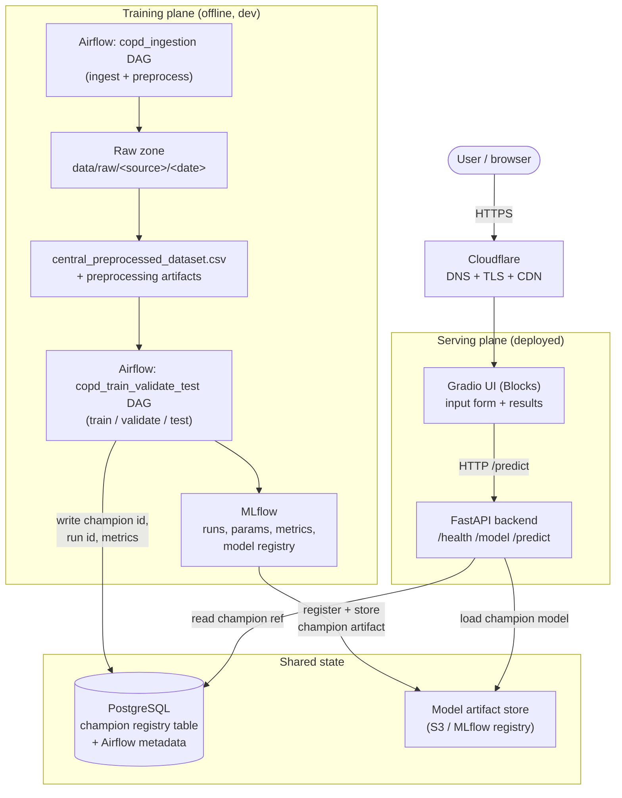
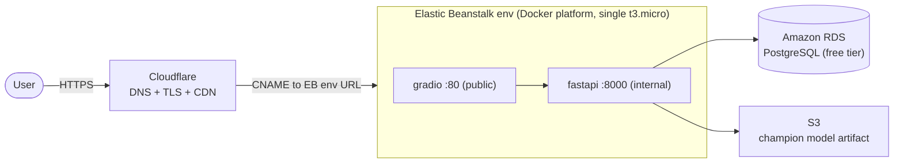

# Architecture

End-to-end architecture for the COPD prediction project. The system has two
planes: an **offline training plane** (Airflow + MLflow, run in dev) that produces
a champion model, and an **online serving plane** (Gradio + FastAPI + PostgreSQL)
that is containerized and deployed to AWS Elastic Beanstalk behind Cloudflare.

UI decision: **Gradio (Blocks API)**, not Streamlit — Blocks gives a custom,
multi-component layout while staying pure-Python. The frontend and backend are
**two separate services**, matching the project spec's UI/backend split.

## Component overview



## Components and responsibilities

| Component | Responsibility | Notes |
|---|---|---|
| Airflow | Orchestrates the two DAGs (ingestion, train/validate/test) | Airflow 3.3.0; runs in dev, not part of the public deployment |
| MLflow | Tracks runs (params/metrics/artifacts), holds the model registry, selects/registers the champion | Backed by PostgreSQL + an artifact store |
| PostgreSQL | (a) app model-registry table, (b) MLflow backend store, (c) Airflow metadata | One instance, separate databases/schemas |
| Model artifact store | Holds the champion model binary the API loads at serving time | S3 bucket (recommended) or MLflow registry URI |
| FastAPI backend | Reads the champion reference from Postgres, loads the model, serves `/predict` | Stateless; the only component that talks to the model + DB |
| Gradio UI (Blocks) | Patient input form, calls the backend, shows the prediction + champion metadata | Pure Python; the only public-facing service |
| Cloudflare | DNS, managed TLS, CDN, hides the EB origin | Proxies to the Elastic Beanstalk environment URL |

## Data flow

**Offline (training):** the `copd_ingestion` DAG lands raw sources and writes the
central preprocessed CSV; the `copd_train_validate_test` DAG trains the candidate
models (SVM, decision tree, random forest, CatBoost/LightGBM), logs every run to
MLflow, selects the champion by the agreed metric, registers it, and writes the
champion's id + run id + metrics to the PostgreSQL registry table.

**Online (serving):** the browser hits Cloudflare over HTTPS; Cloudflare proxies
to Elastic Beanstalk; the Gradio UI takes the patient inputs and calls
`POST /predict` on the FastAPI backend; the backend reads the current champion
reference from Postgres, loads that model from the artifact store (cached after
first load), runs the prediction, and returns the result plus champion metadata
for the UI to display.

## FastAPI backend contract (draft)

| Endpoint | Method | Purpose |
|---|---|---|
| `/health` | GET | Liveness/readiness for EB + Cloudflare health checks |
| `/model` | GET | Current champion metadata (name, id, run id, metrics, timestamp) from Postgres |
| `/predict` | POST | Body = patient feature JSON; returns prediction + champion metadata |

This `/predict` + champion-registry table is the handoff contract with the
modeling stage: modeling writes the champion row, serving reads it. Neither side
needs to know the other's internals.

## Local development (Docker Compose)

Run the serving plane locally with one compose file:

```
services:
  postgres    -> registry DB (and MLflow store)
  mlflow      -> tracking server (dev only; optional in prod)
  fastapi     -> backend, depends_on postgres; loads champion model
  gradio      -> UI, depends_on fastapi; BACKEND_URL=http://fastapi:8000
```

Only `gradio` is published to the host; `fastapi` is reached over the internal
Compose network. Airflow keeps its own existing compose stack (it's dev infra and
is not shipped to production).

## Deployment: AWS Elastic Beanstalk + Cloudflare



Key points for a free-tier, low-complexity deploy:

- **Platform:** EB "Docker" platform (Amazon Linux 2023), which runs a
  `docker-compose.yml` on a single `t3.micro`/`t2.micro` instance (free-tier
  eligible). No ECS/Fargate needed.
- **One public port:** EB routes port 80 to the container that listens on 80.
  Publish **only Gradio on 80**; keep FastAPI internal on the Compose network
  (Gradio calls it at `http://fastapi:8000`). No extra reverse proxy required.
- **Database:** Amazon RDS PostgreSQL (free tier) for the registry table, or a
  Postgres container on the instance for the very simplest setup (data is
  ephemeral if the instance is replaced — RDS is safer).
- **Model artifact:** simplest robust option is an **S3 bucket**; the backend
  pulls the champion binary at startup using the reference in Postgres. (Baking
  the model into the backend image also works but couples deploys to retraining.)
- **Cloudflare:** point a Cloudflare-managed domain at the EB environment URL via
  CNAME, proxy enabled, so Cloudflare terminates TLS and fronts the origin. EB
  health check hits `/health`.
- **Config/secrets:** EB environment properties inject `DATABASE_URL`,
  `BACKEND_URL`, S3 bucket name, and AWS creds/role into the containers.

### Why the training plane is not deployed
Airflow and MLflow are heavy and only needed to *produce* the champion, not to
serve it. Running them on a free-tier instance alongside the app would be fragile.
So they stay in dev; the deployment carries only what serving needs — the champion
artifact, the registry table, FastAPI, and Gradio. This keeps the public footprint
small and cheap.

## Open decisions to confirm with the team

1. **Model delivery to prod** — S3 artifact (recommended), MLflow registry reachable
   from prod, or model baked into the backend image. Affects the retrain→redeploy loop.
2. **Postgres in prod** — RDS free tier (durable) vs a container (simplest, ephemeral).
3. **One instance vs split** — for the demo, one EB instance running both containers
   is enough; splitting Gradio/FastAPI into separate EB environments is possible later.
```
